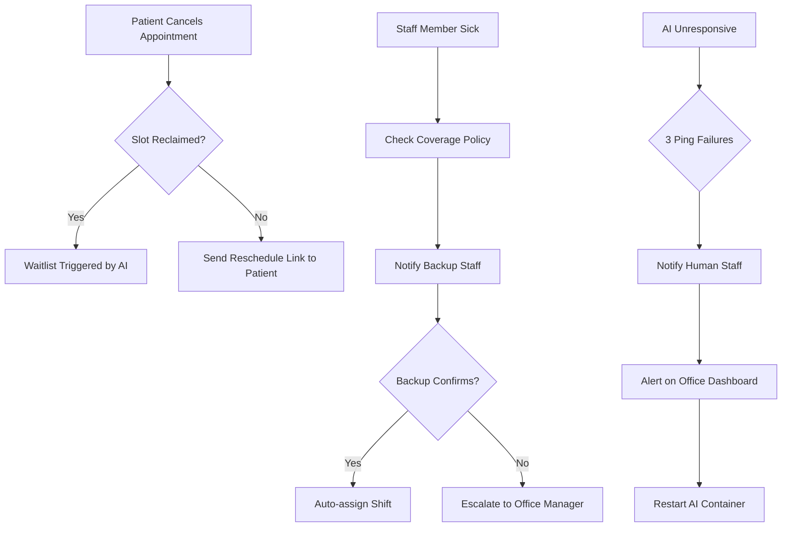

# Fallback & Escalation Flow – Dental Office

```mermaid
graph TD
    A[Patient Cancels Appointment] --> B{Slot Reclaimed?}
    B -- Yes --> C[Waitlist Triggered by AI]
    B -- No --> D[Send Reschedule Link to Patient]

    E[Staff Member Sick] --> F[Check Coverage Policy]
    F --> G[Notify Backup Staff]
    G --> H{Backup Confirms?}
    H -- Yes --> I[Auto-assign Shift]
    H -- No --> J[Escalate to Office Manager]

    K[AI Unresponsive] --> L{3 Ping Failures}
    L --> M[Notify Human Staff]
    M --> N[Alert on Office Dashboard]
    N --> O[Restart AI Container]
```
